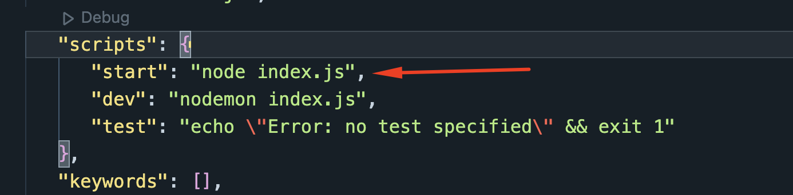

## To clone the project:

1. open project folder terminal and type

```
npm i
```

2. open package.json file and in the `scripts` object add these key value pairs:

```
"start": "node index.js",
```



3. create a `.env.` file in the root directory, and inside that give these values according to your project

```
DB_USER= your mongo db user name
DB_PASS= your mongo db password
JWT_API_SECRET= your jwt secret key
PAYMENT_SECRET= stripe payment secret
```
